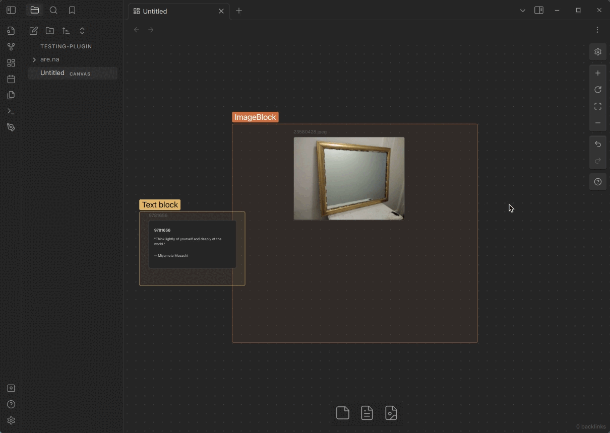

# Are.na plugin for Obsidian

Allows you to save [Are.na](are.na/about) blocks as Obsidian notes.

## Manual installation

Not recommended, use the community plugin browser instead ([coming soon](https://github.com/obsidianmd/obsidian-releases/pull/2592)).

1. Download `main.js`, `manifest.json` and `styles.css` from the [latest release](https://github.com/0xroko/obsidian-arena-plugin/releases)
2. Move `main.js`, `manifest.json` and `styles.css` to your vault `.obsidian/plugins/arena` folder (create `arena` folder)
3. Reload Obsidian (CTRL + R)
4. Go to settings and disable safe mode
5. Enable `Are.na unofficial`

## Features

-   Local first, save Are.na blocks in your Obsidian notes
-   Display Are.na blocks in your Obsidian notes, block <-> note
-   Support for all block types
-   Easily open Are.na blocks in your browser
-   No DB -> file name is the block id

If you want to see a feature implemented, open an issue or a PR.

## Usage

### Login

Navigate to the plugin settings and login with your Are.na account.

### Insert block

1. Open the command palette and search for `Insert Are.na block`
2. Done! Block will be inserted in your current note (and saved locally in `are.na` folder)
